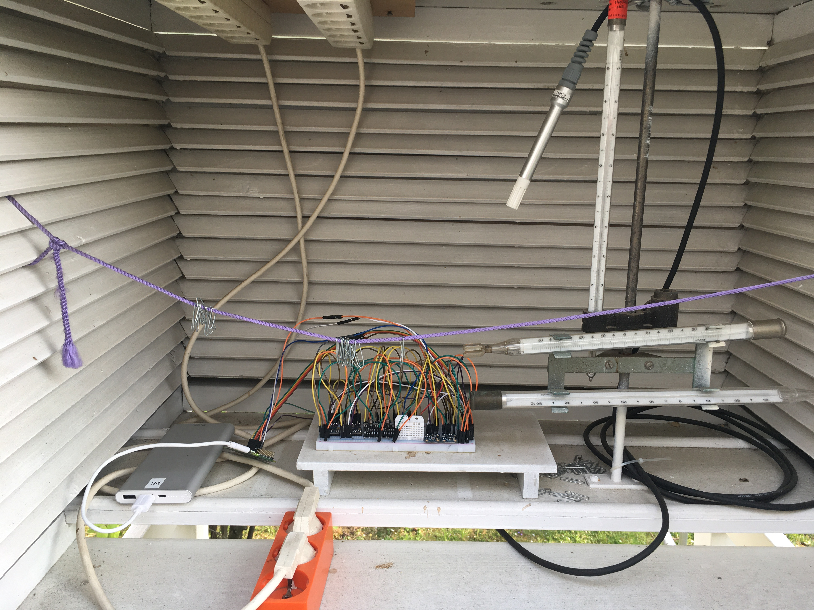
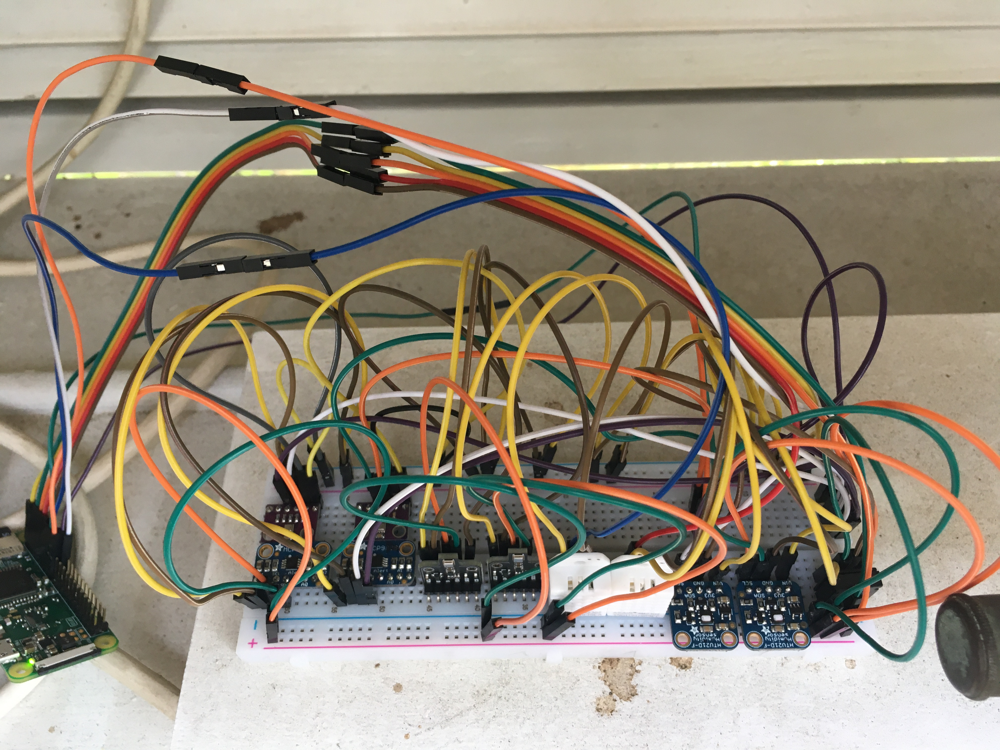

# Temperature & Humidity Sensor Test

Comparison between the sensors AM2320,DHT22,HTU21D,MCP9808,BME680, BME280 and the CS215 in the climate station at Werthmannstrasse 10 from 3rd to 5th of March, 2020.

 

Temperature
============

Table 1: Coefficients to correct temperatures and root mean square error (RMSE) of the raw and calibrated temperatures relative to the climate station in K

|Sensor | a0 (Offset) | a1 (Slope) | RMSE (raw) | RMSE (calib) |
| --- | ---: | ---: |  ---: | ---: |
|AM2320	|-0.4452 |	1.02780	|0.2107049|	0.079546|
|1_DHT22	|-0.2868|	1.02920	|0.1750821	|0.089617
|2_DHT22	|-0.3820|	1.03000	|0.1847389	|0.094950
|1_HTU21D	|0.1769	|1.00440	|0.2388976	|0.078499
|2_HTU21D	|0.4499	|1.00280	|0.4875104	|0.086191
|1_MCP9808|	-0.2153	|1.01150|	0.1523272	|0.109667
|2_MCP9808|	0.0167|	1.00716	|0.1587282	|0.121885
|1_BME680	|0.0541	|0.99297	|0.08693147	|0.075257
|2_BME680	|-0.0829|	0.98992|	0.2188592	|0.082456
|1_BME280	|0.9421	|0.99980|	0.9483656	|0.124448
|2_BME280	|0.7338	|1.00180|	0.7602216	|0.110038

Humidity
============

Table 2: Coefficients to correct vapor pressure and root mean square error (RMSE) of the raw and calibrated vapor pressure relative to the climate station in K

|Sensor | a0 (Offset) | a1 (Slope) | RMSE (raw) | RMSE (calib) |
| --- | ---: | ---: |  ---: | ---: |
|AM2320	|0.8477	|0.74930	|1.189864	|0.231711|
|1_DHT22	|0.6247	|0.94360|	0.2714386	|0.087445|
|2_DHT22	|0.6745	|0.89050|	0.1458398	|0.094100|
|1_HTU21D	|0.3980	|0.95980|	0.1908347	|0.138263|
|2_HTU21D	|0.4823	|0.95580|	0.232505	|0.131855|
|1_BME680	|1.5380	|0.79600|	0.2779574	|0.136056|
|2_BME680	|1.5892	|0.79630|	0.3271391	|0.139714|
|1_BME280 |-0.0493|	1.16144|	0.9195801|	0.134975|

